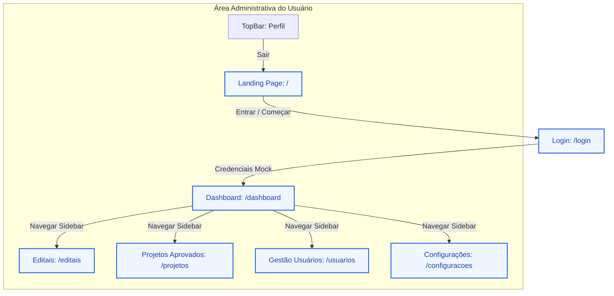

# 🗺️ Mapa Arquitetural do Projeto: Capta+

Bem-vindo ao mapa oficial do **Capta+** (Gestão Inteligente de Editais e Captação de Recursos). Este guia foi desenvolvido para servir como uma referência rápida e estruturada sobre a arquitetura do projeto, facilitando a adição de novos recursos, páginas ou componentes de forma consistente e rápida.

---

## 🚀 1. Stack Tecnológica e Bibliotecas

O projeto é construído sobre bases modernas e focadas em desempenho, tipagem estática e estilização ultra-eficiente:

*   **Framework Principal**: [Next.js 14.0.0](https://nextjs.org/) (App Router)
*   **Biblioteca de UI**: [React 18.2.0](https://react.dev/)
*   **Linguagem**: [TypeScript 5.2.2](https://www.typescriptlang.org/)
*   **Estilização**: CSS Puro (Vanilla CSS) com um sistema de variáveis e classes utilitárias personalizadas localizadas em `app/globals.css` e `styles/components.css` *(Evita dependência de TailwindCSS de forma nativa)*.
*   **Ícones**: [Lucide React 0.294.0](https://lucide.dev/)
*   **Utilitários**: `clsx` + Helper `cn` personalizado em `lib/utils.ts` para fusão condicional de classes CSS.
*   **Banco de Dados**: SQLite via `better-sqlite3` + Drizzle ORM
*   **Autenticação**: `bcrypt` para hash de senhas + cookies HTTP-only

---

## 📂 2. Estrutura de Diretórios

O projeto segue a estrutura recomendada do Next.js App Router com separação clara de responsabilidades:

```text
captaMais/
├── app/                      # Roteamento e Páginas (App Router)
│   ├── api/                  # Rotas de API
│   │   ├── editais/          # API de editais
│   │   ├── jobs/             # Jobs agendados
│   │   ├── teste/            # Rotas de teste
│   │   └── v1/
│   │       ├── editais/      # API v1 de editais
│   │       ├── import/       # Importação de dados
│   │       └── usuarios/    # API de usuários (CRUD + Login)
│   │           ├── cadastrar/route.ts  # POST - Cadastro
│   │           ├── login/route.ts      # POST - Login
│   │           ├── [id]/route.ts       # GET/PUT/DELETE
│   │           └── route.ts            # GET - Listar todos
│   ├── configuracoes/        # Página de Configurações (/configuracoes)
│   │   └── page.tsx
│   ├── dashboard/            # Painel Geral / Visão Geral (/dashboard)
│   │   └── page.tsx
│   ├── editais/              # Módulo de Busca/Filtro de Editais (/editais)
│   │   └── page.tsx
│   ├── login/                # Página de Acesso / Login (/login)
│   │   └── page.tsx
│   ├── projetos/             # Projetos Aprovados (/projetos)
│   │   └── page.tsx
│   ├── usuarios/             # Gestão de Equipe e Organização (/usuarios)
│   │   └── page.tsx
│   ├── globals.css           # Variáveis de Design Token e Classes Utilitárias
│   ├── layout.tsx            # HTML Base (<html> e <body>)
│   └── page.tsx              # Landing Page Principal (/)
├── components/               # Componentes Reutilizáveis
│   ├── layout/               # Elementos Estruturais Globais
│   │   ├── main-layout.tsx   # Wrapper com Sidebar + TopBar + Main
│   │   ├── sidebar.tsx       # Menu lateral de navegação
│   │   └── topbar.tsx        # Barra superior com busca e perfil
│   └── ui/                   # Componentes de Interface Átomos/Moleculas
│       ├── badge.tsx         # Rótulos de Status / Badges
│       ├── button.tsx        # Botão customizado com variantes
│       ├── card.tsx          # Contêineres de conteúdo estruturado
│       └── input.tsx         # Campos de texto padronizados
├── lib/                      # Utilitários de Código
│   ├── utils.ts              # Função cn() para mesclagem de classes CSS
│   └── database/             # Camada de Banco de Dados
│       ├── db.ts             # Conexão SQLite + Criacao de tabelas
│       ├── schema.ts         # Definicao das tabelas (Drizzle ORM)
│       ├── seed.ts           # Seed para usuario admin
│       ├── migrations/       # Migrations do banco
│       ├── repositories/     # Repositories (acesso a dados)
│       │   ├── base.repository.ts
│       │   ├── edital.repository.ts
│       │   ├── analise.repository.ts
│       │   ├── palavra-chave.repository.ts
│       │   ├── search.repository.ts
│       │   └── usuario.repository.ts   # CRUD de usuarios
│       └── services/         # Services (logica de negocio)
│           ├── edital.service.ts
│           ├── file.service.ts
│           ├── import.service.ts
│           └── usuario.service.ts      # Auth + bcrypt
├── data/                     # Dados do projeto
│   └── db/
│       └── editais.db        # Banco SQLite
├── middleware.ts              # Middleware de autenticacao (Next.js)
├── styles/                   # Folhas de Estilo Específicas
│   └── components.css        # Estilos globais para componentes de UI
├── next.config.js            # Configurações do Next.js
├── tsconfig.json             # Configurações do compilador TypeScript
└── package.json              # Dependências e scripts do projeto
```

---

## 🎨 3. Sistema de Design & Estilização (Design Tokens)

O projeto possui um **Design System interno** implementado via variáveis nativas do CSS (`:root` em `app/globals.css`). Evite usar cores estáticas (`#fff`, `#000`, etc.) no código React; sempre utilize as variáveis definidas para consistência estética e facilidade de suporte a temas.

### 🎨 Paleta de Cores e Tokens Core

| Nome do Token | Valor Hex/Padrão | Propósito / Aplicação |
| :--- | :--- | :--- |
| `--color-primary` | `#2563eb` (Blue 600) | Cor de marca principal, botões de ação e links ativos |
| `--color-primary-hover` | `#1d4ed8` (Blue 700) | Estado `:hover` do azul primário |
| `--color-secondary` | `#64748b` (Slate 500) | Elementos neutros secundários, descrições secundárias |
| `--color-success` | `#10b981` (Emerald 500) | Status positivo, aprovações, editais abertos |
| `--color-warning` | `#f59e0b` (Amber 500) | Status de atenção, prorrogações, prazos curtos |
| `--color-danger` | `#ef4444` (Red 500) | Status crítico, exclusão, erros ou inatividade |
| `--color-gray-50` a `900` | Escala neutra de cinzas | Fundos, bordas, divisores e hierarquia tipográfica |
| `--spacing-xs` a `2xl` | `0.25rem` a `3rem` | Margens (`margin`) e espaçamentos internos (`padding`) |
| `--radius-sm` a `lg` | `0.25rem` a `0.75rem` | Bordas arredondadas de botões, cards e modais |
| `--shadow-sm` a `lg` | Sombras CSS suaves | Elevação de componentes e menus suspensos |

### 🛠️ Classes Utilitárias (Mimetismo TailwindCSS)
Para desenvolvimento ágil sem Tailwind, o arquivo `app/globals.css` disponibiliza classes auxiliares:
*   **Flexbox**: `.flex`, `.flex-col`, `.flex-row`, `.items-center`, `.justify-between`, `.justify-center`, `.gap-xs`, `.gap-sm`, `.gap-md`, `.gap-lg`, `.gap-xl`
*   **Grids**: `.grid`, `.grid-cols-1`, `.grid-cols-2`, `.grid-cols-3`, `.grid-cols-4`
*   **Grids Responsivos**: `.md:grid-cols-2`, `.lg:grid-cols-3`, `.lg:grid-cols-4` (completamente definidos em `@media`)
*   **Espaçamento Rápido**: `.p-sm`, `.p-md`, `.px-md`, `.py-sm`, `.mb-md`, `.mt-sm`, etc.
*   **Tipografia**: `.text-xs` a `.text-3xl`, `.font-medium`, `.font-semibold`, `.font-bold`
*   **Estilos Rápidos**: `.bg-white`, `.bg-gray-50`, `.rounded-lg`, `.border`, `.shadow-md`

---

## 🧩 4. Especificações dos Componentes Reutilizáveis (`components/ui`)

### 🔘 4.1. Button (`components/ui/button.tsx`)
Extensão de `React.ButtonHTMLAttributes<HTMLButtonElement>` com variantes integradas no CSS.

*   **Props**:
    *   `variant` (opcional): `"default"` (azul sólido), `"outline"` (borda cinza), `"ghost"` (fundo transparente, hover cinza).
    *   `size` (opcional): `"default"` (médio), `"sm"` (pequeno para tabelas/filtros), `"lg"` (botões de Hero/destaque).
*   **Exemplo de Uso**:
    ```tsx
    import { Button } from "@/components/ui/button"
    import { Plus } from "lucide-react"

    <Button variant="outline" size="sm" onClick={handleEvent}>
      <Plus className="mr-xs h-4 w-4" /> Novo Item
    </Button>
    ```

---

### 🎴 4.2. Card (`components/ui/card.tsx`)
Composto por múltiplos subcomponentes utilitários para criar blocos informativos coesos.

*   **Subcomponentes**: `Card`, `CardHeader`, `CardTitle`, `CardDescription`, `CardContent`, `CardFooter`.
*   **Exemplo de Uso**:
    ```tsx
    import { Card, CardHeader, CardTitle, CardDescription, CardContent } from "@/components/ui/card"

    <Card>
      <CardHeader>
        <CardTitle>Título do Painel</CardTitle>
        <CardDescription>Subtítulo ou instrução de apoio.</CardDescription>
      </CardHeader>
      <CardContent>
        <p>Conteúdo principal do painel...</p>
      </CardContent>
    </Card>
    ```

---

### 🏷️ 4.3. Badge (`components/ui/badge.tsx`)
Etiquetas informativas de status rápidas e visualmente atraentes.

*   **Props**:
    *   `variant` (opcional): `"default"` (azul claro), `"success"` (verde), `"warning"` (laranja), `"danger"` (vermelho).
*   **Exemplo de Uso**:
    ```tsx
    import { Badge } from "@/components/ui/badge"

    <Badge variant="success">Inscrições Abertas</Badge>
    <Badge variant="warning">Prorrogado</Badge>
    ```

---

### 📝 4.4. Input (`components/ui/input.tsx`)
Campo de entrada de texto padronizado com transições de foco suaves.

*   **Exemplo de Uso**:
    ```tsx
    import { Input } from "@/components/ui/input"

    <Input type="email" placeholder="Digite seu e-mail corporativo..." />
    ```

---

## 🗄️ 5. Banco de Dados (SQLite + Drizzle ORM)

### Estrutura de Conexão
*   **Localização**: `data/db/editais.db`
*   **Driver**: `better-sqlite3`
*   **ORM**: Drizzle ORM
*   **Config**: `lib/database/db.ts`

### Tabela: `usuarios`

| Campo | Tipo | Constraints | Descrição |
|-------|------|-------------|-----------|
| `id` | TEXT | PRIMARY KEY | UUID do usuário |
| `nome` | TEXT | NOT NULL | Nome completo |
| `email` | TEXT | NOT NULL, UNIQUE | Email para login |
| `password` | TEXT | NOT NULL | Senha com hash bcrypt |
| `role` | TEXT | DEFAULT 'leitor' | Papel: admin, editor, leitor |
| `status` | TEXT | DEFAULT 'ativo' | Status: ativo, inativo |
| `criado_em` | TEXT | DEFAULT CURRENT_TIMESTAMP | Data de criação |
| `atualizado_em` | TEXT | DEFAULT CURRENT_TIMESTAMP | Última atualização |

### Tabela: `editais`

| Campo | Tipo | Descrição |
|-------|------|-----------|
| `id` | TEXT | PRIMARY KEY |
| `titulo` | TEXT | Título do edital |
| `orgao` | TEXT | Órgão responsável |
| `valor` | TEXT | Valor estimado |
| `status` | TEXT | Aberto, Prorrogado, Em Analise, Fechado |
| `link` | TEXT | Link do edital |

### Outras Tabelas
*   `analise_ia` - Análises de IA dos editais
*   `analise_requisitos` - Requisitos dos editais
*   `analise_itens_financiaveis` - Itens financiáveis
*   `analise_documentos` - Documentos necessários
*   `analise_criterios` - Critérios de avaliação
*   `analise_pontos_fracos` - Pontos fracos
*   `palavras_chave` - Palavras-chave
*   `arquivos_anexos` - Arquivos anexos
*   `motivos_pontuacao` - Motivos de pontuação
*   `areas_tematicas` - Áreas temáticas
*   `tipos_proponente` - Tipos de proponente

---

## 🔐 6. Sistema de Autenticação

### Fluxo de Login
1. Usuário envia `email` e `password` para `POST /api/v1/usuarios/login`
2. Service valida credenciais com `bcrypt.compare()`
3. Se válido, retorna dados do usuário e define cookie `usuario_logado`
4. Cookie é HTTP-only e seguro em produção

### Middleware de Proteção (`middleware.ts`)
*   **Rotas públicas**: `/`, `/login`, `/api/v1/usuarios/cadastrar`, `/api/v1/usuarios/login`
*   **Rotas protegidas**: Todas as outras
*   **Behavior**: Redireciona para `/login` se não autenticado (páginas) ou retorna 401 (API)

### Seed Admin
```bash
npx tsx lib/database/seed.ts
```
*   Email: `admin@capta.com`
*   Senha: `admin123`

---

## 🌐 7. API Routes (v1)

### Usuários (`/api/v1/usuarios`)

| Método | Rota | Body | Descrição |
|--------|------|------|-----------|
| `POST` | `/cadastrar` | `{nome, email, password, confirmarPassword}` | Cadastro |
| `POST` | `/login` | `{email, password}` | Login |
| `GET` | `/` | - | Listar todos |
| `GET` | `/[id]` | - | Buscar por ID |
| `PUT` | `/[id]` | `{nome?, email?, role?, status?}` | Atualizar |
| `DELETE` | `/[id]` | - | Deletar |

### Editais (`/api/v1/editais`)

| Método | Rota | Descrição |
|--------|------|-----------|
| `GET` | `/` | Listar editais |
| `GET` | `/stats` | Estatísticas |
| `GET` | `/filters` | Filtros disponíveis |
| `GET` | `/search` | Busca full-text |
| `GET` | `/[id]` | Detalhes do edital |
| `POST` | `/[id]/analyze` | Analisar com IA |
| `PUT` | `/[id]/status` | Atualizar status |

### Importação (`/api/v1/import`)

| Método | Rota | Descrição |
|--------|------|-----------|
| `POST` | `/folder` | Importar pasta |
| `GET` | `/status` | Status da importação |

---

## 🗺️ 8. Catálogo de Páginas & Fluxo de Rota

Abaixo está o mapeamento visual do fluxo de rotas do Capta+ usando Mermaid:



### 📋 Informações Detalhadas de Rota

| URL / Rota | Arquivo de Entrada | Status atual | Características / Lógica do Mock |
| :--- | :--- | :--- | :--- |
| `/` | `app/page.tsx` | **Completo** | Landing page pública, com seções de recursos, estatísticas chamativas e direcionamentos de fluxo. |
| `/login` | `app/login/page.tsx` | **Completo** | Autenticação real com banco de dados. Valida email/senha via API. |
| `/dashboard` | `app/dashboard/page.tsx` | **Completo** | Exibe métricas de captação (cards) e a tabela dos últimos editais publicados. |
| `/editais` | `app/editais/page.tsx` | **Completo** | Busca inteligente com filtro lateral funcional para áreas de interesse (Saúde, Educação, etc.) e tipos de instituição. |
| `/projetos` | `app/projetos/page.tsx` | *Mock / Construção* | Exibe um estado vazio de apoio (`empty-state`) com ilustrações para projetos aprovados futuros. |
| `/usuarios` | `app/usuarios/page.tsx` | **Completo** | Gestão de equipe real com dados do banco. CRUD completo via API. Modal de cadastro. |
| `/configuracoes` | `app/configuracoes/page.tsx` | *Mock / Construção* | Tela provisória em desenvolvimento para futuras parametrizações. |

---

## 🛠️ 9. Guia Prático para Incremento do Projeto

Quando solicitado pelo usuário para realizar alterações ou adicionar novas telas/componentes, siga este roteiro de melhores práticas estruturais:

### 🆕 Como Criar uma Nova Página Interna
1. **Defina a Rota**: Crie uma pasta dentro de `app/` (exemplo: `app/relatorios/`).
2. **Crie o Arquivo**: Adicione `page.tsx` dentro do diretório.
3. **Use o MainLayout**: Envolva o conteúdo da página no componente `<MainLayout>` para carregar a Sidebar e a TopBar de forma transparente:
    ```tsx
    import { MainLayout } from "@/components/layout/main-layout"

    export default function RelatoriosPage() {
      return (
        <MainLayout>
          <div className="dashboard-header">
            <h2 className="dashboard-title">Relatórios Estratégicos</h2>
            <p className="dashboard-subtitle">Acompanhe as estatísticas de captação</p>
          </div>
          {/* Insira Cards e Componentes de UI aqui */}
        </MainLayout>
      )
    }
    ```
4. **Atualize o Menu Lateral**: Se necessário, abra `components/layout/sidebar.tsx`, adicione a nova rota e o ícone correspondente do `lucide-react` no array `menuItems`.

### 🆕 Como Criar uma Nova API Route
1. **Crie o Diretório**: `app/api/v1/nome-rota/`
2. **Crie o Arquivo `route.ts`**:
    ```typescript
    import { NextRequest, NextResponse } from 'next/server';

    export async function GET(request: NextRequest) {
      try {
        // Lógica aqui
        return NextResponse.json({ data: 'resultado' });
      } catch (error: any) {
        return NextResponse.json({ error: error.message }, { status: 500 });
      }
    }

    export async function POST(request: NextRequest) {
      try {
        const body = await request.json();
        // Lógica aqui
        return NextResponse.json({ success: true }, { status: 201 });
      } catch (error: any) {
        return NextResponse.json({ error: error.message }, { status: 400 });
      }
    }
    ```

### 🆕 Como Adicionar uma Nova Tabela no Banco
1. **Adicione o Schema** em `lib/database/schema.ts`:
    ```typescript
    export const novaTabela = sqliteTable('nova_tabela', {
      id: integer('id').primaryKey({ autoIncrement: true }),
      nome: text('nome').notNull(),
      criadoEm: text('criado_em').default('CURRENT_TIMESTAMP'),
    });
    ```
2. **Adicione o SQL** em `lib/database/db.ts` dentro de `createTables()`:
    ```typescript
    sqlite.exec(`
      CREATE TABLE IF NOT EXISTS nova_tabela (
        id INTEGER PRIMARY KEY AUTOINCREMENT,
        nome TEXT NOT NULL,
        criado_em TEXT DEFAULT CURRENT_TIMESTAMP
      );
    `);
    ```
3. **Crie o Repository** em `lib/database/repositories/nova-tabela.repository.ts`
4. **Crie o Service** em `lib/database/services/nova-tabela.service.ts`

### 🔄 Como Adicionar Estilos Condicionais ou Responsividade
*   **Media Queries**: Em vez de declarar blocos `@media` dispersos, utilize as classes já embutidas no `app/globals.css`, tais como `.grid .grid-cols-1 .md:grid-cols-2 .lg:grid-cols-4`.
*   **Junção Condicional com cn()**: Use o utilitário para definir estilos com base no estado do componente:
    ```tsx
    import { cn } from "@/lib/utils"

    interface CustomBoxProps {
      active: boolean
    }

    export function CustomBox({ active }: CustomBoxProps) {
      return (
        <div className={cn("p-md rounded border bg-white", active && "active-style-class")}>
          ...
        </div>
      )
    }
    ```

---

## 🚨 10. Diretrizes Críticas de Codificação

> [!IMPORTANT]
> **Preservação de Padrões Estéticos**
> O projeto utiliza um sistema visual muito polido, com cantos arredondados generosos (`--radius-lg`), sombras suaves e micro-interações integradas ao CSS. Mantenha essa mesma identidade nas novas implementações.

> [!WARNING]
> **Evite TailwindCSS**
> Não instale Tailwind ou adicione classes dele, a menos que explicitamente ordenado pelo usuário. Toda a estilização rápida e estruturada deve utilizar as classes utilitárias nativas declaradas no arquivo `app/globals.css` ou regras puras inseridas em `styles/components.css`.

> [!TIP]
> **Sem Placeholders Genéricos**
> Se precisar incluir novas representações estéticas ou simular dados, use mocks realistas baseados em estruturas brasileiras de editais (ex: Ministério da Saúde, Ministério da Cultura, CNPJ reais mockados) para que a experiência do usuário se sinta premium e de nível de produção.

> [!WARNING]
> **Senhas e Segurança**
> Nunca salve senhas em texto plano. Sempre use `bcrypt` com no mínimo 10 rounds. Nunca exponha dados sensíveis em logs ou respostas da API.

> [!IMPORTANT]
> **Padrão Repository/Service**
> Para acessar o banco de dados, siga o padrão estabelecido:
> - **Repository**: Acesso direto ao banco (queries SQL/Drizzle)
> - **Service**: Lógica de negócio, validações e transformações
> - **Route**: Comunicação HTTP (request/response)

---

## 📚 11. Comandos Úteis

```bash
# Desenvolvimento
npm run dev              # Inicia o servidor de desenvolvimento

# Build
npm run build            # Gera build de produção

# Lint
npm run lint             # Verifica erros de lint

# Testes
npm run test             # Roda testes uma vez
npm run test:watch       # Roda testes em watch mode

# Banco de Dados
npx tsx lib/database/seed.ts  # Cria usuário admin (admin@capta.com / admin123)
```
